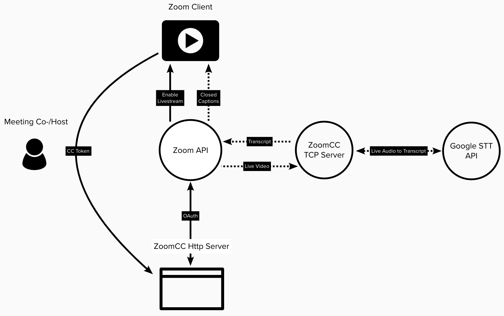

# Zoom Closed Caption Concept

## Summary

ZoomCC is a live closed caption service for your Zoom meeting. To start closed captioning for your meeting, copy the 3rd Party Closed Captioning Service API Token and paste it here.

## Architecture

ZoomCC mainly consists of an http and tcp server: The http server provides the client UI, authenticates the Zoom user and starts the user's meeting live stream. The tcp server recieves the rtmp live stream, transcodes the video, pipes the audio to Google's Speech-To-Text engine and sends the captions back to Zoom.



## Setup Guide

1. Clone this repo
2. Install the FFMPEG binary on your system (through brew, etc): https://ffmpeg.org/
3. Install NGROK (note you need a paid account to tunnel both http and tcp public ports to your localhost): https://ngrok.com/
4. Create a Zoom Marketplace OAuth App and add your tunneled NGROK paths to your localhost: https://marketplace.zoom.us/
5. Add your tunneled NGROK paths to your dotenv file (example below)
6. Add your Google Speech-To-Text Service Account json file to the root directory and name it SAKEY.json: https://cloud.google.com/speech-to-text
7. Run npm run start:all, visit http://localHost:3000 and enter in your meeting 3rd Party Closed Captioning Service API Token.
8. See your captions appear on your Zoom meeting.

### NGROK command line examples

To create a tunnel to your localhost:
`[ngrok path] [http/tcp] [3000/1935]`

### Sample .env file

````CLIENT_ID=XXXXXXXXXXXXX
CLIENT_SECRET=XXXXXXXXXXXXX
REDIRECT_URL=XXXXXXXXXXXXX
RTMP_URL=rtmp://XXXXXXXXXXXXX/live
ZOOM_API_URL=https://api.zoom.us```
````
